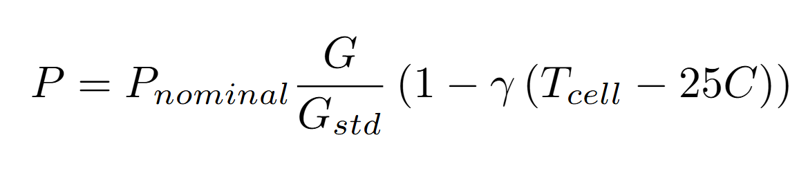
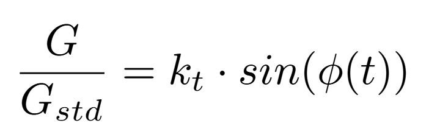
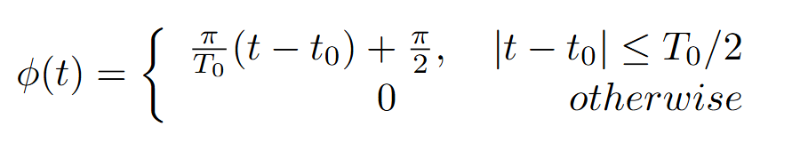
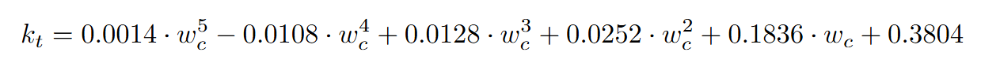

# Solar field output simulation by Monte Carlo method
Being able to predict the energy output of a solar field in a given day and, in a broader sense, an average day is of paramount importance:
1) in the first case, it allows to the owner of the plant to sell a power profile to the grid during the daily energy trading activities;
2) in the second case, it is important to simulate the power output of a solar field before its realization in order to evaluate the profitability of the investment.

For this reason, I decided to use some common python libraries (*math, random, numpy*) to implement a model that answer the first question and a Monte Carlo simulation that, applied to said model, allows to statistically describe the output of a solar field on a given day.

>*Note*: a Monte Carlo simulation requires to follow these steps:
>1) establish a subset of input parameters,
>2) randomly generate an input dictated by a probability distribution over said domain,
>3) compute **deterministically** the output through a model,
>4) aggregate the results. 

> IMPORTANT: The Jupyter notebook containing the code can be found [HERE](https://github.com/Andrea1999Broglia/Solar-field-output-Montecarlo-analysis/blob/main/model.ipynb)

# The model
The equation used to calculate the power output of the plant at any given moment is the following equation reported by Brecl et al. [1]:

  

where $P_{nominal}$ is the nominal power of the field (or more specifically of the solar cell), G is the irradiance which undergoes the field, $G_{std}$ is the standard reference for irradiance ($1000 \ W/m^2$), $\gamma$ is a parameter that accounts for temperature effects on the cell efficiency and $T_{cell}$ is the temperature of the cell.

In a random day, two variables will hence impact P: the irradiance and the temperature. 

So, for each day a profile of irradiance and temperature will be generated.

In particular, the $\frac{G}{G_{std}}$ is calculated as per following empirical correlation:

  

where

  

given that t is the time in the day, $t_{0}$ is noon
and $T_0$ is the duration of the day. As per Brecl et al. [1], 

  

where $w_c$ is the weather class, a score that translates a weather forecast/condition to an integer number:

| **Weather** | **$w_c$** | 
|-----------|-----------|
| Clear   | 4    |
| Mostly clear    | 3    |
| Partly cloudy   | 2    |
| Prevailingly cloudy    | 1    |
| Overcast | 0    |
| Overcast with heavy rain | -1    |

# Monte Carlo analysis

# Bibliography
1) > **Kristijan Brecl**, **Marko Topič**, *Photovoltaics (PV) System Energy Forecast on the Basis of the Local Weather Forecast: Problems, Uncertainties and Solutions*, Energies, Volume 11, 2018, Number 5, Article Number 1143, [DOI: 10.3390/en11051143](https://doi.org/10.3390/en11051143).  

2) > **Swapnil Dubey**, **Jatin Narotam Sarvaiya**, **Bharath Seshadri**, *Temperature Dependent Photovoltaic (PV) Efficiency and Its Effect on PV Production in the World – A Review*, Energy Procedia, Volume 33, 2013, Pages 311-321, ISSN 1876-6102, [DOI: 10.1016/j.egypro.2013.05.072](https://doi.org/10.1016/j.egypro.2013.05.072)  

 

