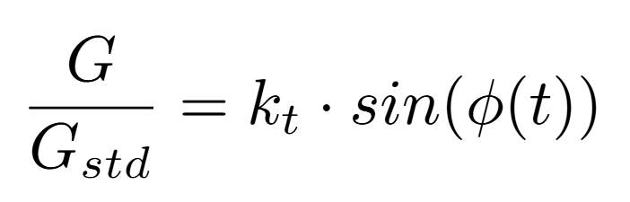
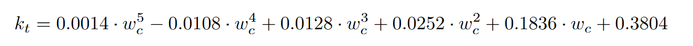
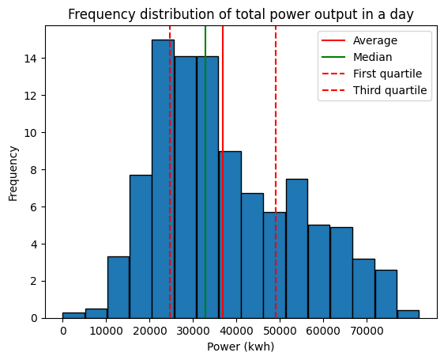

# Solar-field-output-simulation-by-Monte-Carlo-method

Being able to predict the energy output of a solar field in a given day and, in a broader sense, an average day is of paramount importance:
1) in the first case, it allows traders to bid a power profile during the daily energy trading activities;
2) in the second case, it is important to simulate the power output of a solar field before its realization in order to evaluate the profitability of a possible investment.

For this reason, I decided to use some common python libraries (*math, random, numpy*) to implement a model that answer the first question and a Monte Carlo simulation that, applied to said model, allows to statistically describe the output of a solar field on a given day.

>*Note*: a Monte Carlo simulation requires to follow these steps:
>1) establish a subset of input parameters,
>2) randomly generate an input dictated by a probability distribution over said domain,
>3) compute **deterministically** the output through a model,
>4) aggregate the results. 

> IMPORTANT: The Jupyter notebook containing the code can be found and downloaded [HERE](https://github.com/Andrea1999Broglia/Solar-field-output-Montecarlo-analysis/blob/main/model.ipynb)

# The Data
This model aims at simulating the performance of 10 MW solar field in Milan. As a conseuqence, the weather phenomena distribution was based on the historical data provided by [Il Meteo](https://www.ilmeteo.it/portale/archivio-meteo).

Moreover, the expected daily power output was compared with the data regarding the energy price in Milan during all of 2024 (Prezzo zonale Nord) provided by [GME](https://www.mercatoelettrico.org/it-it/Home/Esiti/Elettricita/MGP/Esiti/PUN).

# The model
The equation used to calculate the power output of the plant at any given moment is the following equation reported by Brecl et al. [1]:

  

where $P_{nominal}$ is the nominal power of the field (or more specifically of the solar cell), G is the irradiance which undergoes the field, $G_{std}$ is the standard reference for irradiance ($1000 \ W/m^2$), $\gamma$ is a parameter that accounts for temperature effects on the cell efficiency and $T_{cell}$ is the temperature of the cell.

In a random day, two variables will hence impact P: the irradiance and the temperature. 

So, for each day a profile of irradiance and temperature will be generated.

In particular, the $\frac{G}{G_{std}}$ is calculated as per following empirical correlation:

  

where

  

given that t is the time in the day, $t_{0}$ is noon
and $T_0$ is the duration of the day. As per Brecl et al. [1], 

  

where $w_c$ is the weather class, a score that translates a weather forecast/condition to an integer number:

| **Weather** | **$w_c$** | 
|-----------|-----------|
| Clear   | 4    |
| Mostly clear    | 3    |
| Partly cloudy   | 2    |
| Prevailingly cloudy    | 1    |
| Overcast | 0    |
| Overcast with heavy rain | -1    |

# Monte Carlo analysis

**1) Input dominion**

The data needed to generate a power output value are:
-   the nominal power of the plant, which is given,
-   $\gamma$, which is given ($\simeq$ 0.004 as per Dubey et al. [2])
- the temperature,
- the irradiance ratio.

It was decided to randomly generate two values:
-   the duration of the day in minutes, whose dominion is every possible duration in Milan during the year, which is minimum 500 minutes and maximum 940 minutes. The dominion was represented as an array extending from 515 to 915 ([515, 501, 502, ..., 915]).
-   the weather class of the day, which can be chosen among the values in the table above. To take into account the variability of the weather class during the day, every four and a half hours the weather class can be increased or decreased by 0.5.
-   the moment of maximum temperature of the day $t_{max}$, between 11:00 and 14:00.

>*Note about the day duration*: 
The duration of the day was established as detailed in a work by Forsythe et al. [3] which consists of an overview regarding different models, among which there is the Brock model, which was adopted.

**2) random input generation**

Both the duration of the day and the first weather class of the day are generated following a uniform probability distribution over both dominions.

**3) deterministical output evaluation**
Given the duration of the day and the weather class, at any time the ratio between the actual and standard irradiation can be evaluated. 

For what concerns the temperature, instead, a minimum and a maximum temperature where randomly generated through a function that chooses among a set of values correlated to the day duration. This is done since, likely, a long day is in summer and a short day is in winter.

Given the maximum and minimum temperature, the temperature profile was calculated as:

  

where the higher the $\sigma$ value, the broader the temperature function gets. Clearly, this is a really rough estimate of the temperature of the cell.

At this point, all parameters needed for the power calculation are available.

**4) Data aggregation**

First of all, a randomly generated power output profile looks like this:

  

but, given that the input is random, the output may differ:

  

One thousand random day were generated and their average and standrd error were calculated:

  

Note that the nominal power is not even in range.

For what concerns the cumulate energy production per day, the results are displayed in the following frequency graph:

  

In this simulation, the minimum daily power output was 294 kwh, the maximum was 76245 kWh, and the average was 36850 kwh which corresponds to 1351 equivalent hours per year. 

# Energy Price
It was deemed of interest to compare the average daily power profile with the average daily power price, as seen in the following graph:

  

 
The average price is around 108 €/MWh, but since there is a lack of overlap between the energy price and output, it is reasonable to expect that this phenomenon could damage the revenue stream of the solar field.

As a matter of fact, by calculating the power output-weighted average price, the resulting price is lowered to 99.55 €/MWh. 
This phenomenon, detrimental to the profitability of solar fields, is called _duck curve_.
 

# Bibliography
1) > **Kristijan Brecl**, **Marko Topič**, *Photovoltaics (PV) System Energy Forecast on the Basis of the Local Weather Forecast: Problems, Uncertainties and Solutions*, Energies, Volume 11, 2018, Number 5, Article Number 1143, [DOI: 10.3390/en11051143](https://doi.org/10.3390/en11051143).  

2) > **Swapnil Dubey**, **Jatin Narotam Sarvaiya**, **Bharath Seshadri**, *Temperature Dependent Photovoltaic (PV) Efficiency and Its Effect on PV Production in the World – A Review*, Energy Procedia, Volume 33, 2013, Pages 311-321, ISSN 1876-6102, [DOI: 10.1016/j.egypro.2013.05.072](https://doi.org/10.1016/j.egypro.2013.05.072)  

3) > **Forsythe, W. C., Rykiel, E. J., Stahl, R. S., Wu, H., & Schoolfield, R. M. (1995)**. A model comparison for daylength as a function of latitude and day of year. *Ecological Modelling, 80*(1), 87-95. [https://doi.org/10.1016/0304-3800(94)00034-F](https://doi.org/10.1016/0304-3800(94)00034-F)

 

